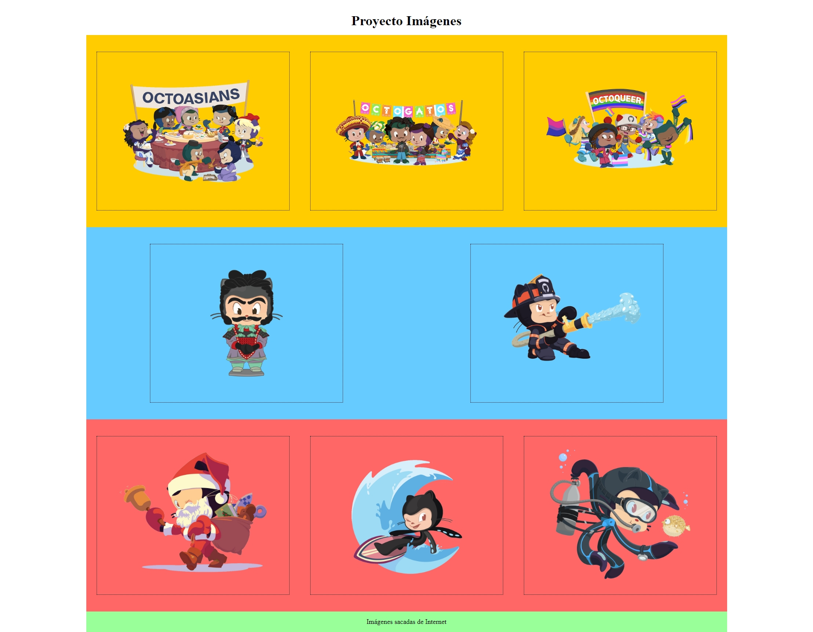

# Proyecto Imágenes

Este proyecto muestra una página que presenta varias imágenes organizadas en bloques de colores. La página está estructurada con HTML y estilizada con CSS.

## Vista del Modelo

Aquí puedes ver la imagen del modelo que se utilizó como referencia:

## Vista Codificada

A continuación, se muestra la imagen del resultado codificado:

## Estructura del Proyecto

El proyecto se compone de las siguientes secciones:

- **Título Principal**: Un encabezado que indica el nombre del proyecto.
- **Bloques de Imágenes**: Tres bloques de colores diferentes que contienen varias imágenes:
  - **Bloque Amarillo**: Contiene tres imágenes.
  - **Bloque Celeste**: Contiene dos imágenes.
  - **Bloque Rosado**: Contiene tres imágenes.
- **Enlace Verde**: Un enlace que dirige a la fuente de las imágenes en Internet.

## Tecnologías Utilizadas
- HTML5: Para la estructura del contenido.
- CSS3: Para el diseño y estilos de la página.